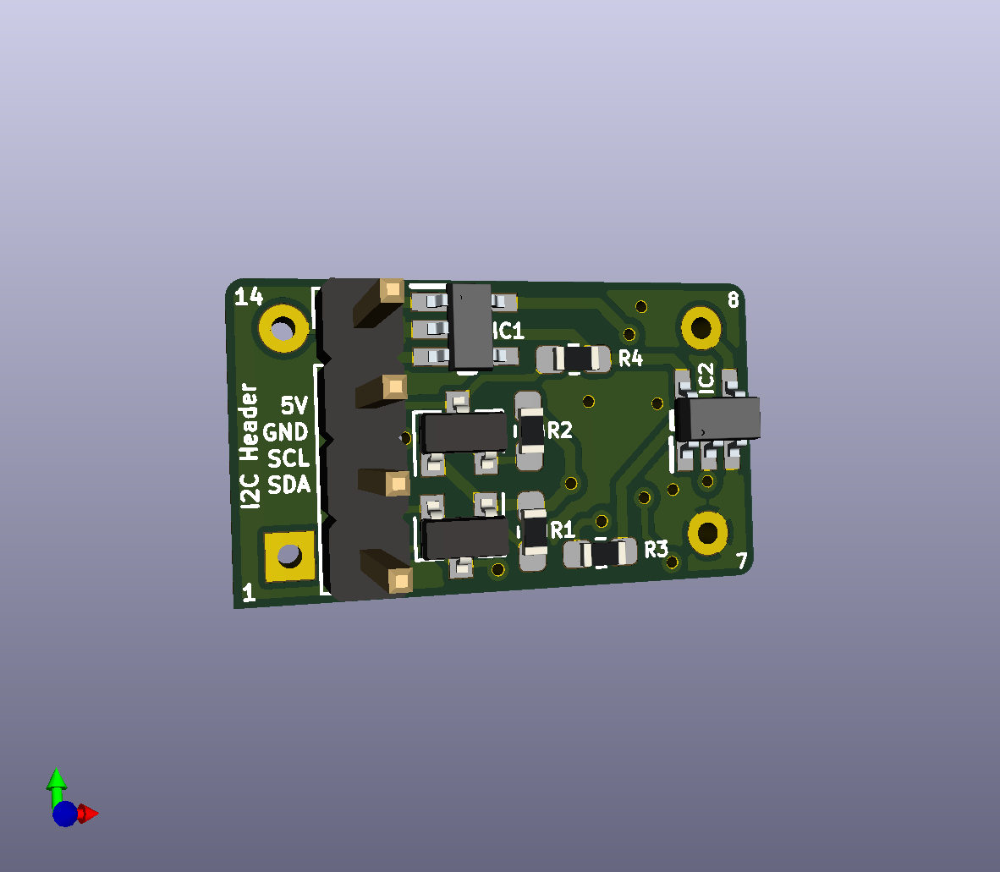
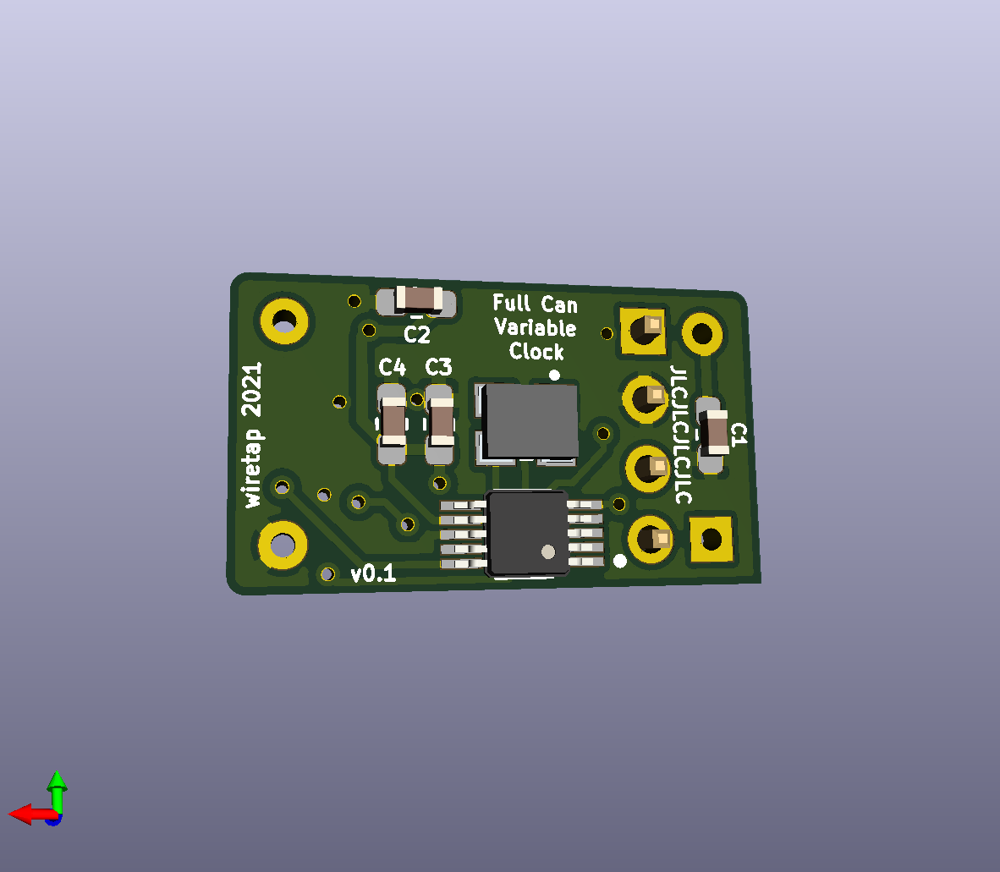

# Full Can Variable Crystal Oscillator
A full can size crystal oscillator that can be programmed for the frequency you need.

\

## Info
This variable crystal oscillator in a full-can form factor can be programmed from frequencies 8kHz to 160MHz. An arduino or pi can easily be used to hook up to the i2c port to set the frequency. Use a 3.3V SMD crystal oscillator and install into a 5V system.
\
\
This project is based on the Adafruit Si5351 found here: https://learn.adafruit.com/adafruit-si5351-clock-generator-breakout

## Programming
The Adafruit tutorial found here is how this device is programmed: https://learn.adafruit.com/adafruit-si5351-clock-generator-breakout/wiring-and-test

## Notes
This project does not utilize the clock enable pin (EN on most datasheets), so it can only be used in parent boards that don't make active use of the clock enable/disable function.
